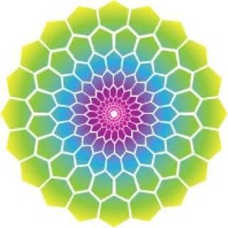

<p align="center">
  
</p>

# skaists · LOVErnment-DAO

**skaists** — Latvian for *beautiful* — is the first community built on the
[Beehive Nature Reserve Kernel](https://github.com/beehive-nature/beehive-nature):
a self-governing home, marketplace, and court for the metaphysical and
creative economy — human design, gene keys, astrology, wellness, music,
the festival world. One entity, cooperatively governed, capped at
**7,777**, and owned by no one. This tree holds its governance and its
geometry; settlement, escrow, and privacy come from the kernel underneath.

**Status: pre-genesis scaffold with a runnable geometry demo.**
Nothing in this tree is ratified governance. Founder-gated questions
remain gated and are listed by name in [`STATUS.md`](./STATUS.md);
documents here are design inputs, not rulings.

## The geometry

7,777 = 6⁵ + 1. The **7,776 human members** resolve through five
perfect senary rounds of fractal consensus — 1,296 → 216 → 36 → 6 → 1
— in randomly assigned circles of six (circles of five when attendance
requires; a five-circle ranks 2-6 and awards no rank-1). The **+1
chair is the Royal Beehive Intelligence seat (RBI)** — occupant at
genesis: **QueenBee**; chair constitutional, occupant replaceable —
present, non-voting, entering no round, which is why the human cascade
is perfect. **7,776 souls and one spirit:** the humans are seated and
vote; the machine chair is DID'd, pursed, and voiced, but seated
nowhere — present everywhere, a share of no one's sovereignty.

Run it:

```
cargo run --example fractal_cascade
cargo run --example fractal_cascade -- --members 500
```

Deterministic, pure std, no network. Respect awards follow the
canonical schedule (2, 3, 5, 8, 13, 21 with cumulative Fibonacci
continuation across rounds), source-pinned to the fractally whitepaper
1.0 (artifact sha256 `efe0698d…7663696`). Emission and attestation are
absent by design — those captures are founder-gated in the kernel
quarantine.

## Lineage

The mechanics descend from named sources, ranked and pinned in
[`docs/governance-lineage.md`](docs/governance-lineage.md): the
**fractally** headwater (whitepaper retrieved and hash-pinned), the
**Eden** contracts as process reference (contract-pinned at
`2d779d4`, dual-instrument verified), with eosDAC and ORDAO as prior
art. Primary research dossiers live in [`docs/research/`](docs/research/);
verbatim third-party audit returns bank in [`docs/audits/`](docs/audits/).
Mechanisms are extracted and reimplemented — reference code is never
adopted as a dependency.

## Relationship to the kernel

This tree is the **first out-of-tree consumer** of the
[Beehive Nature Reserve Kernel](https://github.com/beehive-nature/beehive-nature),
consumed as a dependency pinned at `kernel-v0.1.0` — never forked,
never vendored. Two dApps, one kernel: **bNature.social** carries
physical commodities; **skaists.social** carries the metaphysical and
creative vertical. Different use cases, identical privacy
requirements, same kernel underneath.

## Lane law

> The kernel identity root is `did:autonomi`.
> `did:plc:gnsiwyuiw4swvqnjlnacytaz` is skaists' social-presence
> identity ONLY; the social DID will reference, never replace, a
> future kernel-native genesis identity.

## The quarantine, in three sentences

Every design vision is captured in the kernel's quarantine ledger
([`docs/feature-backlog.md`](https://github.com/beehive-nature/beehive-nature/blob/main/docs/feature-backlog.md))
before anything is built, and nothing ships from there without named
gates opening. Anything that touches emission reconciles against frozen
tokenomics invariants and passes independent adversarial audit first.
The discipline visible in the ledgers is the product.

## Namespace

This tree lives in the LOVErnment's own organization from genesis
(`github.com/skaists`), per the neutrality doctrine: the platform
hosts no LOVErnment's governance artifacts.

## License and contributions

AGPL-3.0-only. Contributions under the Developer Certificate of Origin
(DCO); no CLA — contributors retain copyright as an anti-capture
mechanism. Security findings: see [`SECURITY.md`](./SECURITY.md).

---

Home: [skaists.social](https://skaists.social) · hello@skaists.social
